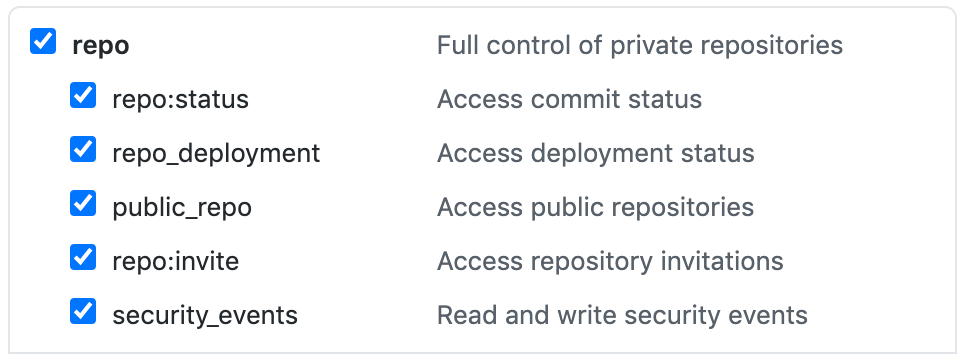

# react-rm

This program serves as a small command-line utility to remove all reactions 
from any issue in a given repository.

## Prerequisites

### Github API Token

This program uses the Github personal access token for authorization and authentication.

To create a new Github Token, follow the [GitHub documentation](https://docs.github.com/en/github/authenticating-to-github/creating-a-personal-access-token#creating-a-token).

This application requires the `repo` access.



### Configuration file

The program expects a configuration file. See the example [github-cli](./docs/github-cli.yml).

Copy this configuration file into the default `~/.config` location:

```
cp docs/github-cli.yml ~/.config/
```

Alternatively, you can use any other location on the system. The program uses the `-c` flag for
passing a configuration file path, e.g.:

```
react-rm -c github-cli
```

Edit the configuration file with your values.

## Installation

Ensure you have:

1. Generated your API token
1. Copied the `github-cli.yml` file to `~/.config`

To install react-rm:

1. Download the latest binary: [macOS](https://github.com/m-czernek/react-rm/releases/latest/download/react-rm_darwin) or [Linux](https://github.com/m-czernek/react-rm/releases/latest/download/react-rm_linux)
1. Make the binary executable: `chmod +x ~/Downloads/react-rm_linux`
1. Copy the binary to $PATH, for example: `sudo cp ~/Downloads/react-rm_linux /usr/local/bin/react-rm`

You can now execute `react-rm`:

```shell
$ react-rm -h
Usage of react-rm:
  -c string
    	A path to the YAML configuration file (default: /home/mczernek/.config/github-cli.yml)
  -l	List people with more than 3 votes
$ react-rm -l
Removed 0 issue reactions from repo RedHatTraining/appdev

User john-doe-gh has 9 reactions in the repo
```

## Building

To build the Go binary, execute:

```
make
```

To cross-compile for Linux and macOS, execute:

```
make build-all
```

Binaries are saved into the `bin` directory

## Executing

To execute the program, execute: 

```
make run
```
